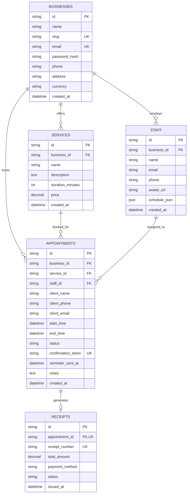
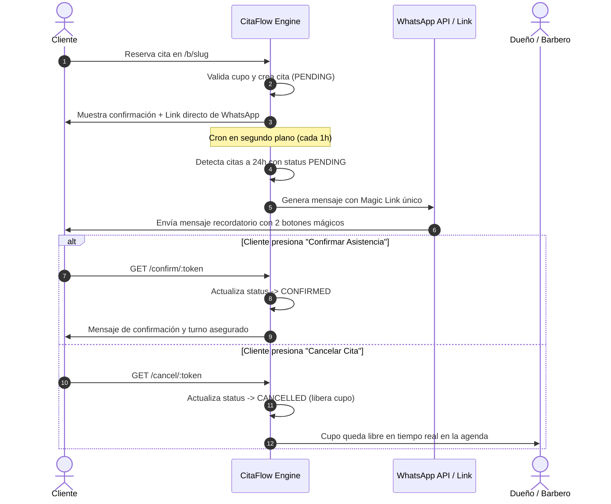

# 💈 CitaFlow (Micro-SaaS MVP)

> **Plataforma lean de agendamiento inteligente y eliminación de ausentismo (no-shows) para Barberías, Peluquerías y Estudios de Estética Independientes.**

---

## 🚀 Resumen del Producto

- **Problema:** En el sector de barberías y estudios de estética, los *no-shows* (clientes que reservan pero no asisten) generan pérdidas de hasta un 28% de los ingresos netos. El agendamiento manual por chat genera dobles turnos y pérdida de tiempo del dueño.
- **Solución CitaFlow:** Una experiencia de reserva mobile-first ultrarrápida combinada con un **motor de cupos en tiempo real sin solapamientos** y **recordatorios automáticos por WhatsApp con Enlaces Mágicos en 1 Clic** (Confirmar asistencia o Cancelar con anticipación).
- **Acceso Rápido Local:**
  - 🌐 **Página Principal / Landing:** [http://localhost:3000/](http://localhost:3000/)
  - 💈 **Reserva Pública Cliente (Demo):** [http://localhost:3000/b/barberia-imperio](http://localhost:3000/b/barberia-imperio)
  - 📊 **Panel de Control (Admin):** [http://localhost:3000/admin](http://localhost:3000/admin)
  - 🔑 **Credenciales Demo:** `admin@barberiaimperio.com` / `Password123!`

---

## 🏛️ Arquitectura Técnica y Tech Stack

```
citaflow/
├── prisma/
│   ├── schema.prisma              # Prisma Schema con SQLite para ejecución local zero-config
│   ├── schema.postgresql.prisma   # Prisma Schema para PostgreSQL en producción
│   ├── schema.postgres.sql        # Script DDL PostgreSQL 3NF con constraints e índices
│   └── seed.js                    # Script de sembrado de datos de prueba
├── src/
│   ├── config/
│   │   └── prisma.js              # Instancia singleton de Prisma Client
│   ├── middlewares/
│   │   ├── auth.middleware.js     # Verificación de JWT Bearer tokens
│   │   ├── validate.middleware.js # Validación estricta con Zod contra Inyección y XSS
│   │   ├── rateLimiter.middleware.js # Rate limiting para endpoints públicos y de autenticación
│   │   └── errorHandler.middleware.js # Manejador centralizado de errores
│   ├── services/
│   │   ├── auth.service.js        # Onboarding de negocio, bcrypt hashing y JWT
│   │   ├── booking.service.js     # Motor de cálculo de cupos y prevención de doble turno
│   │   ├── reminder.service.js    # Constructor WhatsApp, Magic Links y escáner 24h
│   │   └── receipt.service.js     # Generación de comprobantes y plantilla HTML/PDF
│   ├── controllers/
│   │   ├── auth.controller.js
│   │   ├── public.controller.js
│   │   ├── appointment.controller.js
│   │   ├── service.controller.js
│   │   ├── staff.controller.js
│   │   ├── receipt.controller.js
│   │   └── reminder.controller.js
│   ├── routes/
│   │   ├── auth.routes.js
│   │   ├── public.routes.js
│   │   ├── appointment.routes.js
│   │   ├── service.routes.js
│   │   ├── staff.routes.js
│   │   ├── receipt.routes.js
│   │   └── reminder.routes.js
│   ├── public/                    # Frontend UI ultrarrápido y responsivo
│   │   ├── index.html             # Landing page de conversión del Micro-SaaS
│   │   ├── booking.html           # Flujo de reserva pública por pasos
│   │   ├── confirm.html           # Magic Link: Confirmación en 1 clic
│   │   ├── cancel.html            # Magic Link: Cancelación / liberación de turno
│   │   ├── admin.html             # Dashboard de administración y calendario
│   │   ├── login.html             # Inicio de sesión con botón demo 1-click
│   │   └── register.html          # Onboarding y registro de nuevos negocios
│   └── server.js                  # Servidor Express, Cron Job y montaje de rutas
├── tests/
│   └── citaflow.test.js           # Suite de pruebas automatizadas de integración
├── .env                           # Variables de entorno
├── .env.example
└── package.json
```

---

## 🗄️ Esquema Relacional en Tercera Forma Normal (3NF)

El modelo de datos cumple rigurosamente con los principios de normalización relacional:
1. **1NF:** Todos los atributos son atómicos con claves primarias definidas (`id`).
2. **2NF:** No existen dependencias funcionales parciales sobre claves compuestas.
3. **3NF:** No existen dependencias transitivas entre columnas no clave.
   - La tabla `receipts` mantiene la integridad transaccional inmutable del precio cobrado en el momento del pago (aislado de futuras variaciones de precios en `services`).
   - Los especialistas tienen horarios modelados estructuradamente en JSON para turnos semanales y descansos.



---

## ⚡ Motor de Cálculo de Cupos y Prevención de Doble Reserva

1. **Parámetros de entrada:** `business_id`, `service_id`, `staff_id` (opcional o `"any"`), `date` (`YYYY-MM-DD`).
2. **Algoritmo de cálculo:**
   - Extrae la duración exacta del servicio solicitado ($D$ minutos).
   - Identifica el día de la semana y obtiene el turno del barbero desde `schedule_json` ($T_{inicio}$ a $T_{fin}$, con intervalo de almuerzo $[L_{inicio}, L_{fin}]$).
   - Carga todas las citas activas del barbero para ese día (`status != 'CANCELLED'`).
   - Genera candidatos de slots en intervalos regulares.
   - Filtra slots que:
     - Terminen después del fin de turno ($Slot_{fin} > T_{fin}$).
     - Se solapen con el almuerzo ($Slot_{inicio} < L_{fin} \land Slot_{fin} > L_{inicio}$).
     - Se solapen con cualquier cita agendada ($Slot_{inicio} < Apt_{fin} \land Slot_{fin} > Apt_{inicio}$).
     - Estén en el pasado si la fecha consultada es el día de hoy.
3. **Garantía atómica anti-colisión:**
   Al crear la cita, el servicio ejecuta una verificación de solapamiento estricta. Si dos clientes intentan reservar el mismo segundo, el segundo recibe un código HTTP `409 Conflict` con un mensaje amigable invitándolo a seleccionar otro horario.

---

## 📲 Integración con Meta WhatsApp Cloud API (Graph API) y Webhooks

CitaFlow soporta tanto **WhatsApp Web manual** como **envío y recepción 100% desatendida** vía Meta WhatsApp Cloud API o Twilio:

### 1. Variables de Configuración en `.env`
```env
# Proveedor: 'mock' (local/testing), 'cloud_api' (Meta), 'twilio'
WHATSAPP_PROVIDER=cloud_api

# Credenciales de Meta Developers:
META_WA_PHONE_NUMBER_ID=1092837465...
META_WA_ACCESS_TOKEN=EAAG...
META_WA_VERIFY_TOKEN=citaflow_meta_verify_token_2026
META_WA_API_VERSION=v21.0
```

### 2. Configuración en Meta for Developers
1. Ve a tu App en [Meta for Developers](https://developers.facebook.com/) > **WhatsApp** > **Configuración**.
2. En **Webhooks**, haz clic en *Editar* y pega:
   - **URL de devolución de llamada (Callback URL):** `https://tu-dominio.com/api/webhook/whatsapp`
   - **Token de verificación:** `citaflow_meta_verify_token_2026`
3. Suscríbete al campo: `messages`.

### 3. Mensajes Interactivos con Botones de Respuesta Rápida
Cuando se envía un recordatorio automático 24 horas antes, el mensaje incluye 2 botones interactivos nativos de WhatsApp:
- **`[✅ Confirmar Turno]`** (Payload: `CONFIRM_<appointmentId>`)
- **`[❌ Cancelar Turno]`** (Payload: `CANCEL_<appointmentId>`)

Al presionar cualquiera de los dos botones en su teléfono, WhatsApp envía un Webhook `POST` inmediato a `/api/webhook/whatsapp`. El sistema procesa la solicitud, actualiza el estado de la cita en la base de datos a `CONFIRMED` o `CANCELLED` y responde automáticamente al cliente confirmando la acción, ¡todo sin que el cliente deba abrir un navegador ni iniciar sesión!

### 4. Simulador Integrado en el Dashboard
Dentro del Dashboard (`/admin`), pestaña **"📲 Automatización WhatsApp"**, cuentas con:
- Estado del motor de WhatsApp y logs de auditoría en vivo.
- Datos listos para copiar a Meta Developers.
- **Simulador de Interacción:** Selecciona cualquier cita de la lista y haz clic en *✓ Botón Confirmar* o *✕ Botón Cancelar* para probar el webhook en caliente.

---



---

## 🧪 Pruebas Automatizadas

El proyecto incluye una suite de pruebas de integración completa (`tests/citaflow.test.js`) que valida:
- Onboarding automático de negocios (3NF)
- Autenticación segura con bcrypt y JWT
- Cálculo de cupos disponibles sin solapamientos
- Prevención estricta de doble reserva (`409 Conflict`)
- Magic Links y cambio de estado a `CONFIRMED`
- Emisión de recibos y renderizado de HTML descargable/imprimible

Para ejecutar los tests en cualquier momento:
```bash
node tests/citaflow.test.js
```

---

## 🛠️ Comandos de Ejecución

```bash
# Iniciar servidor en modo desarrollo
npm run dev

# Iniciar servidor en producción
npm start

# Ejecutar migraciones / sincronización Prisma
npm run prisma:push

# Poblar base de datos con datos de prueba
npm run seed
```

---

## 🐳 Despliegue con Docker y Docker Compose

El proyecto está 100% preparado para producción con Docker multi-stage y PostgreSQL 16 relacional (3NF):

### 1. Iniciar todo el ecosistema con un solo comando
```bash
docker compose up --build -d
```

Este comando:
1. Construye la imagen ultra-optimizada de CitaFlow (`citaflow-app`) basada en `node:20-alpine`.
2. Levanta el contenedor de PostgreSQL 16 (`citaflow-db`) con volumen persistente (`citaflow_pgdata`).
3. Inicializa las tablas 3NF, restricciones e índices automáticamente mediante `prisma/schema.postgres.sql`.
4. Ejecuta `scripts/docker-init.js`, que sincroniza Prisma con PostgreSQL y puebla los datos iniciales de prueba (`SEED_ON_STARTUP=true`).
5. Expone la aplicación en `http://localhost:3000` y PostgreSQL en `localhost:5432`.

### 2. Comandos útiles de Docker
```bash
# Ver logs en vivo
docker compose logs -f

# Detener los contenedores
docker compose down

# Detener eliminando volúmenes (reset completo de base de datos)
docker compose down -v

# Entorno de desarrollo con recarga en vivo (hot-reload)
docker compose -f docker-compose.dev.yml up --build
```

---

## 🌐 Despliegue en la Nube (PaaS / VPS)

Para desplegar en servicios como **Railway**, **Render**, **Fly.io**, **Koyeb** o un **VPS Ubuntu**:
1. Conecta tu repositorio Git o sube los archivos.
2. La plataforma detectará automáticamente el `Dockerfile` y `docker-compose.yml`.
3. Configura tus variables de entorno en el panel del hosting:
   - `DATABASE_URL`: URL de tu base de datos PostgreSQL administrada.
   - `JWT_SECRET`: Una clave aleatoria segura de producción.
   - `FRONTEND_URL`: El dominio público de tu SaaS (ej. `https://citaflow.app`).
   - `WHATSAPP_PROVIDER`: `cloud_api` para envíos reales por Meta Graph API.

